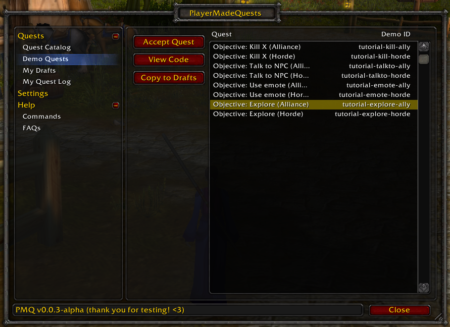
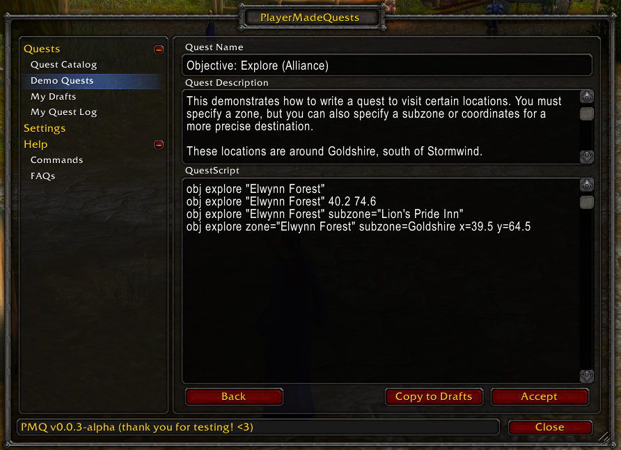

# PlayerMadeQuests

Create and share your own custom quests in World of Warcraft: Classic!

Features:

* Write out your own custom quest with just a few lines of YAML script
* **Demo Quests**: short quests provided with the addon to help you learn how to write your own
* **Real-time Objective Tracking**: plays just like a World of Warcraft quest
* **Quest Sharing**: share your quest with party members with the click of a button*
* **Highly Customizable**: any and all quest text to tell the story (or joke) you want to tell
* **Quest Replay**: you can replay any quests that you've finished previously

*Party members must also have PMQ installed in order to receive shared quests

Upcoming plans for PMQ:

* **Quest Chains**: link multiple quests together to form a larger story
* **More Objectives**: involving items, auras, merchants, and more
* **Localization**: share quests reliably between different-language game clients
* **Quest Development Tools**: tools to track coordinates, NPCs, etc. that you want to put in your quests
* **Quest Builder UI**: build your quest with a friendlier user interface instead of writing script

Download it today: https://www.curseforge.com/wow/addons/pmq

Want to give us feedback during the Beta test? Join us on [Discord](https://discord.gg/U9cDAQg).

Want to contribute code? Check out the [contributing guidelines](CONTRIBUTING.md) for everything you need to know about getting PMQ setup for development.

Several demo quests are included to help you learn how to write quests for PMQ.

You can play these demo quests directly, or you can save a copy to your Drafts and make some changes, then try it out!

Write your own quests in game with just a few lines of script. If you can write a macro, then you can write a quest for PMQ. You can even share your quests with other PMQ users in your party with just the click of a button!

Quest objectives are tracked and updated in real-time as you complete them. Feels like a real quest, without all the calories!

## Planned Features

Check out the [Issues](/../../issues) page for features in the works for PMQ.
