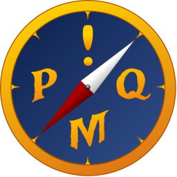

  

<h1 align="center">PlayerMadeQuests</h1>

> PlayerMadeQuests is **no longer being maintained**. You can download the final release from the links below. The contents of the wiki have been copied to this site for your reference.
>
> If you have questions, our [Discord](https://discord.gg/gHMjCgs) server is still open - feel free to stop by! If you're interested in continuing to develop PMQ, you can:
> * Submit a [pull request](https://github.com/runeberry/PlayerMadeQuests/pulls), and reach out to Dolphinspired on Discord for review, or
> * Fork the [repository](https://github.com/runeberry/PlayerMadeQuests) on GitHub, and publish your own version(s) of the addon
>
> To everyone out there who enjoyed the addon, thank you for your support!

* Download PMQ from [CurseForge](https://www.curseforge.com/wow/addons/pmq) (can be installed through the [WowUp](https://wowup.io/) addon manager)
* Download the latest release in a zip file directly from [Github](https://github.com/runeberry/PlayerMadeQuests/releases)
* Read the docs [here](https://www.runeberry.com/PlayerMadeQuests)