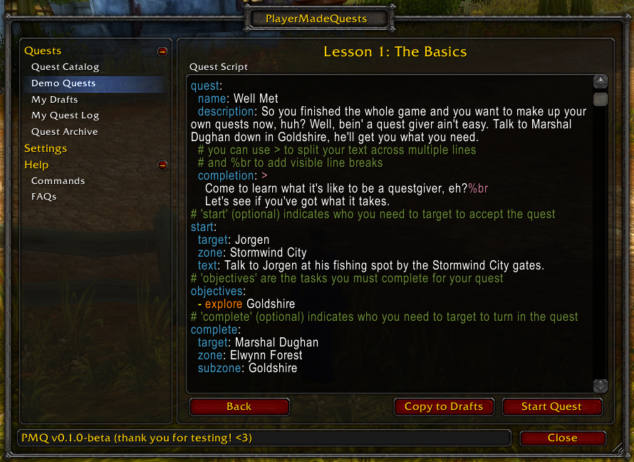

# PlayerMadeQuests

Create and share your own custom quests in World of Warcraft: Classic!


Several demo quests are included to help you learn how to write quests for PMQ.



You can play these demo quests directly, or you can save a copy to your Drafts and make some changes, then try it out!


Write your own quests in game with just a few lines of script. If you can write a macro, then you can write a quest for PMQ. You can even share your quests with other PMQ users in your party with just the click of a button!


Quest objectives are tracked and updated in real-time as you complete them. Feels like a real quest, without all the calories!

## Planned Features

Check out the [Issues](/../../issues) page for features in the works for PMQ.

## Developer Notes

### Running unit tests w/ Docker in Windows

From the repo directory, run:

```ps
.\scripts\docker.cmd
```

This will launch a bash shell in in the Docker container. From there, run any of the Makefile commands:

```bash
make test # runs unit tests
make test-coverage # runs unit tests and prints code coverage to console
make test-report # runs unit tests and prints code coverage as a detailed HTML report
```