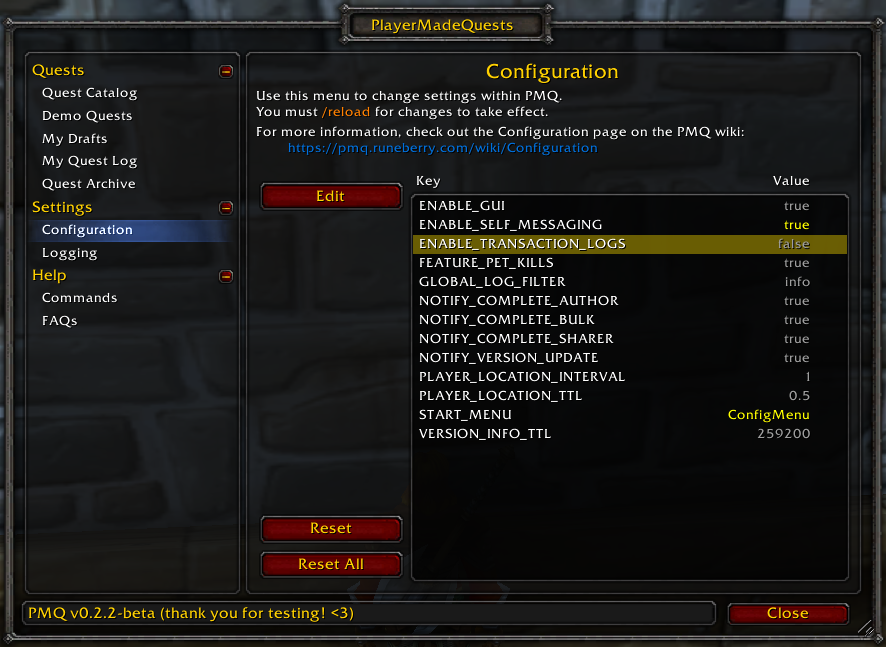

# Configuration

   
  <i>|thumb|The configuration menu in-game</i>

This page outlines the settings you can configure in PMQ.

### Notes

* Settings outlined in gray are set to PMQ's default values, while settings in yellow have been modified by the player. You can reset individual settings or all settings using the buttons in the Configuration menu.
* All settings are currently character-bound, not account-bound.
* You must `/reload` your UI in order for (most) configuration changes to take effect. This may change in a future release, but for now the settings are fixed in place when the addon loads.
* There are plans for a more robust configuration UI to be developed in the future. However, for now this is the quickest way to add new settings without adding additional UI work.

### Settings

| Setting | Expected Value | Description |
|---|---|---|
| ENABLE_GUI | true, false | If false, some GUI elements will not be created on startup. Use for troubleshooting only. |
| ENABLE_SELF_MESSAGING | true, false | If true, any outgoing messages (such as quest sharing) will be redirected back to you with the player name "*yourself*". Use for testing only. |
| ENABLE_TRANSACTION_LOGS | true, false | If true, will output additional logging for Repository transactions.  You will also need to lower the logging level of the appropriate logger(s) to "trace" in the Logging settings. (extremely verbose, enable for debugging only) |
| FEATURE_PET_KILLS | true, false | If true, additional checks will be performed to count your pet's contribution toward any [kill](../objectives/kill.md) objective. |
| FILTER_OFFLINE_MESSAGE | true, false | PMQ needs to put a special chat filter in place to hide all messages that say `No player named '*' is currently playing.` If this causes you trouble for some reason, change this setting to false to disable that filter. |
| GLOBAL_LOG_FILTER | silent, fatal, error, info, debug, trace | Indicates the lowest level of log that should be output to the game console by default. Logging can be further configured in the Logging menu. |
| ITEM_SCAN_LOG_INTERVAL | # items/message | How often the addon should inform you of item scanning progress. A lower number will print chat messages more often. |
| ITEM_SCAN_TIMEOUT | # seconds | How long to wait for the server to response when scanning for items. A lower number will scan faster, but could miss items. |
| NOTIFY_COMPLETE_AUTHOR | true, false | If true, you will be notified when any player completes a quest that you wrote. |
| NOTIFY_COMPLETE_BULK | true, false | If true, you will be notified when any player in your party or raid completes a PMQ quest. |
| NOTIFY_COMPLETE_SHARER | true, false | If true, you will be notified when any player completes a quest that you shared with them. |
| NOTIFY_VERSION_UPDATE | true, false | If true, you will be notified once per game session when there is a known PMQ update available. |
| PLAYER_LOCATION_INTERVAL | # of seconds | Indicates how frequently the addon should check your location when required for [coords](../parameters/coords.md) conditions. |
| PLAYER_LOCATION_TTL | # of seconds | Indicates how long the addon should cache your position in game before checking again. |
| SPELL_SCAN_INTENSITY | # spells/frame | How many spells to scan for on each frame when scanning for spells. A higher number will scan faster, but will hurt game performance. |
| SPELL_SCAN_LOG_INTERVAL | # spells/message | How often the addon should inform you of spell scanning progress. A lower number will print chat messages more often. |
| START_MENU | menu ID | Specify a menu to open when the addon loads. Useful for GUI development. Get the menu IDs from the value properties in [MainMenu.lua](https://github.com/runeberry/PlayerMadeQuests/blob/master/src/gui/MainMenu.lua#L10). |
| VERSION_INFO_TTL | # of seconds | Indicates how long PMQ should remember that addon versions are available and to prompt you to update. (default is 3 days) |
