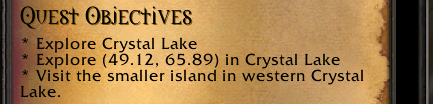
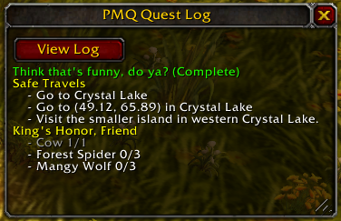

# Objectives

[<sub>← Home</sub>](../index.md)

A quest **objective** is an action you must take in order to make progress toward completing a quest.

## Writing Objectives

<table>
  <tr>
    <td>
      <a href="../assets/images/objectives1.png"></a><br/>
      <i>Quest objectives as shown in quest info</i>
    </td>
    <td>
      <a href="../assets/images/quest-log2.png"></a><br/>
      <i>Quest objectives as shown in the quest log</i>
    </td>
  </tr>
</table>

All objectives are written under the `objectives` property in QuestScript, and each objective must be preceded by a `-`. Here are some formatting examples:

✔️ OK

```yaml
objectives:
  - kill Cow
  - kill 3 Chicken
  - kill 5 "Mangy Wolf"
```

❌ Not OK

```yaml
objectives:
- kill Cow                  # not indented far enough
  -kill 3 Chicken           # no space after dash
    - kill 5 "Mangy Wolf"   # indented too far
```

## Shorthand

Each objective supports a "shorthand" format, which lets you quickly write an objective with only the most basic parameters in a single line. The parameters supported by the shorthand form are different for each objective.

For example, let's break down the shorthand form of the `kill` objective:

```yaml
objectives:
  - kill 5 "Mangy Wolf"
```

When compiled into a quest, this line gets broken apart into the following properties:

* **objective:** kill
* **goal:** 5 *(optional, number of times this objective must be performed)*
* **target:** "Mangy Wolf" *(name of the monster which must be killed)*

Note that multi-word phrases like "Mangy Wolf" must be written with quotes in order to be recognized as a single parameter value in the shorthand form. For single-word phrases, quotes are optional.

The help page for each objective (linked below) will outline the parameters supported by that objective's shorthand form.

## Long-form

If you want to access the full set of parameters for an objective, you can write it out in its complete form, where each parameter of the objective is defined explicitly. For example, the last example would be written in long-form as:

```yaml
objectives:
  - kill:
      goal: 5
      target: Mangy Wolf
```

## List of Quest Objectives

You can see a list of all available quest objectives on the [home page](../index.md).