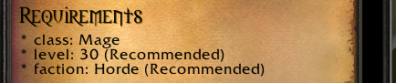
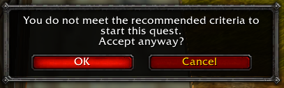

<a href="../index.md"><sub>← Home</sub></a>

# Requirements

<table>
  <tr>
    <td>
      <a href="../assets/images/requirements.png"></a><br/>
      <i>Example of how quest requirements are rendered</i>
    </td>
    <td>
      <a href="../assets/images/recommended-warning.png"></a><br/>
      <i>Warning if a player chooses to accept a quest which they don't meet the recommendations for</i>
    </td>
  </tr>
</table>

By default, quests written in PMQ can be started by any player character without restriction. However, you may want to place some restrictions on who is able to take on your quest. PMQ supports this through the **recommended** and **required** properties on a quest.

```yaml
required:
  class: Mage
recommended:
  level: 30
  faction: Horde
```

### What's the difference?

Both of these properties support all the same parameters and are evaluated in the same way. The only difference is in how they are presented to players when they attempt to start your quest.

* **required** - Players will not be allowed to start your quest if they do not meet the required parameters.
* **recommended** - Players will be prompted with an additional warning dialog when they try to start a quest without the recommended parameters, during which they can choose to start the quest anyway.

### Supported parameters

| Parameter | How it's used |
|---|---|
| [class](../parameters/class.md) | The name of the class allowed to start this quest |
| [faction](../parameters/faction.md) | Either "Horde" or "Alliance" |
| [level](../parameters/level.md) | The minimum level to start the quest |
