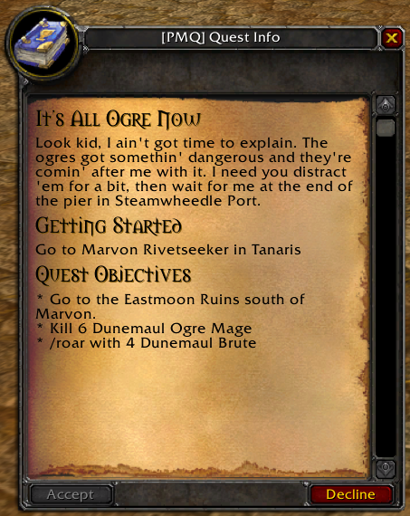
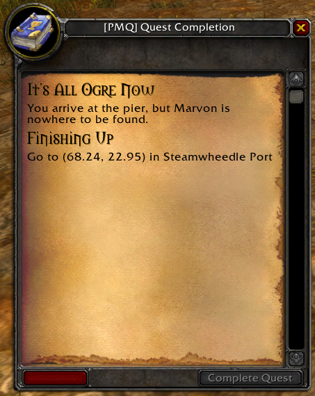

<a href="../index.md"><sub>← Home</sub></a>

# Writing Quests

## How quests are played in PMQ

PMQ was designed to emulate the look and feel of WoW: Classic quests as closely as possible, while still offering enough features and flexibility for players to design truly unique quests that stand apart from those in game. So if you've ever done any questing in WoW: Classic, you will quickly understand how quests are played in PMQ.

That said, there are some differences between PMQ and WoW that you will likely encounter. Let's go over the general gameplay loop for PMQ quests:

### Accepting a quest

You'll be prompted to start a quest when another character shares one with you, when you're testing out a draft that you've written, or when you want to play one of the demo quests packaged with PMQ. Many quests can be started anywhere in the world by any character, but some quests may have additional restrictions:

* Quests can have additional **[Requirements](../guides/requirements.md)** you will need to meet in order to accept the quest, such as level or class requirements.
* Quests may require you to be in a certain area, near a certain NPC or meet some other **[start condition](../guides/start-complete.md)** in order to accept the quest.

### Completing objectives

Most quests will have one or more **[Objectives](../guides/objectives.md)** to complete. Objectives can include killing monsters, talking to NPCs, exploring areas, and much more. Some objectives only need to be completed once, such as exploring an area. But other objectives must be completed multiple times, such as killing 5 of a monster. This number is known as the **[Goal](../parameters/goal.md)** for this objective, and the objective is considered complete when your **progress** is greater than or equal to the goal.

### Turning in a quest

After you've completed all objectives for a quest, the quest itself is considered complete. But you will still need to turn in the quest to consider it "finished". Like when accepting a quest, many quests can be finished anywhere at anytime, but some quests may impose additional rules:
#* Quests may require you to be in a certain area, near a certain NPC or meet some other **[complete condition](../guides/start-complete.md)** in order to finish the quest.

## How to write quests

<table>
  <tr>
    <td>
      <a href="../assets/images/ogre1.png"></a><br/>
      <i>Example rendering of the start block and quest description text</i>
    </td>
    <td>
      <a href="../assets/images/ogre2.png"></a><br/>
      <i>Example rendering of the complete block and quest completion text</i>
    </td>
  </tr>
</table>

PMQ quests are written in-game with a short YAML script. If you're not familiar with YAML, consider reading up on this short [YAML Crash Course](../guides/yaml-crash-course.md) to learn everything you need to know for writing quests in PMQ. If you're comfortable writing simple macros in WoW, then you should have no problem picking up the basics of YAML.

When you're ready to start writing your own quests, start by checking out the **Demo Quests** provided by PMQ (Main Menu &gt; Quests &gt; Demo Quests). You can view the code used write these demos, and you can even copy them directly to your Drafts and start modifying them yourself.

You can also create a new quest from scratch by going to the **My Drafts** menu and selecting New. Be sure to **Save** your changes often, and click **Validate** to see if your quest can be played as it's written. You can start playing your custom quest by selecting the quest, then clicking **Start Quest** on the My Drafts menu.

Ready to learn more? Or just want to see all the options available for PMQ quests? Check out the following guides:

* [Quest recommendations & requirements](../guides/requirements.md)
* [Quest start & complete conditions](../guides/start-complete.md)
* [Quest objectives](../guides/objectives.md)
* [Quest rewards](../guides/rewards.md)

Here's an example of what a fully-featured quest might look like:

```yaml
quest:
  name: It's All Ogre Now
  description: >
    Look kid, I ain't got time to explain. The ogres got somethin'
    dangerous and they're comin' after me with it. I need you distract
    'em for a bit, then wait for me at the end of the pier in
    Steamwheedle Port.
  completion: You arrive at the pier, but Marvon is nowhere to be found.
start:
  zone: Tanaris
  target: Marvon Rivetseeker
objectives:
  - explore:
      zone: Eastmoon Ruins
      text: Go to the %z south of Marvon.
  - kill 6 "Dunemaul Ogre Mage"
  - emote roar 4 "Dunemaul Brute"
complete:
  zone: Steamwheedle Port
  coords: 68.24,22.95
```

Want to see how it works? Feel free to copy-paste this quest into your own draft in-game. Try changing some of the values and see how the quest is changed as a result.
