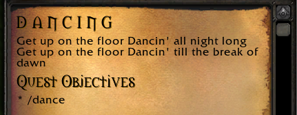
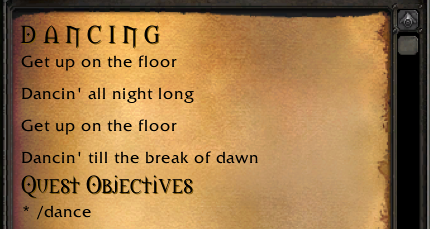

# YAML Crash Course

**YAML** (which stands for "YAML Ain't Markup Language" - yes, really) is a simple language intended for writing configuration files that can be easily read and understood by humans, but also easily parsed by computers. This guide will give you a brief rundown on everything you need to know about YAML to write quests in PMQ.

### Properties and values

```yaml
name: Ragnaros    # this is a string - a line of text
level: 63         # this is a number - can also include decimals
spicy: true       # this is a boolean - can be true or false
```

In this example, we have a simple YAML document with 3 properties: `name`, `level`, and `spicy` - each with a value assigned.

In addition, everything after a `#` character is a comment, which means it will not be interpreted as YAML. I've added some comments explaining what type each value is.

### String quotation

When writing out simple string values in YAML, quotes are generally optional. The following values will all be interpreted in the same way:

```yaml
target: Murloc Steamrunner   # Will print as: Murloc Steamrunner
zone: "Elwynn Forest"        # Will print as: Elwynn Forest
subzone: 'Crystal Lake'      # Will print as: Crystal lake
```

However, if you are using any YAML special characters in your string, then you *must* include quotes. Either single or double quotes are fine.

```yaml
name: Lesson 1: Tutorial     # BAD! YAML gets confused by the extra colon
name: "Lesson 1: Tutorial"   # Easy fix
name: 'Lesson 1: Tutorial'   # Also fine
```

PMQ also includes a special rule for writing shorthand quest [objectives](../guides/objectives.md). When you are writing strings that contain multiple words, you *must* include quotes in order to group these words together.

```yaml
objectives:
  - kill 5 Mangy Wolf        # BAD! Gets broken into 3 parameters: 5, Mangy, and Wolf
  - kill 5 "Mangy Wolf"      # Gets broken into 2 parameters: 5 and Mangy Wolf
```

When in doubt, include quotes anyway!

### Long strings

<table>
  <tr>
    <td>
      <a href="../assets/images/line-break-before.png"></a><br/>
      <i>Before line breaks are added</i>
    </td>
    <td>
      <a href="../assets/images/line-break-after.png"></a><br/>
      <i>After line breaks are added with %br</i>
    </td>
  </tr>
</table>

You can spread a long string over multiple lines by prefixing it with the `>` character, like this:

```yaml
quest:
  description: >
    Get up on the floor
    Dancin' all night long
    Get up on the floor
    Dancin' till the break of dawn
```

However, the above example will still print out as one long line when displayed in game. For cases like this, PMQ allows you to insert line breaks using the special escape code `%br`.

```yaml
quest:
  description: >
    Get up on the floor%br
    Dancin' all night long%br
    Get up on the floor%br
    Dancin' till the break of dawn
```

### Block indentation

```yaml
name: Malfurion
pet: # the "pet" block has 4 properties
  name: Tricky
  species: Raptor
  colors: # the "colors" block has 2 properties
    hide: red
    feathers: green
  level: 35
# Simple blocks can also be written on one line (flow-style)
pet: { name: Tricky, species: Raptor, level: 35 }
```

You can nest properties inside other properties to form a block. This is achieved by simply indenting a line more. It doesn't matter how much you indent the line, as long as you are consistent throughout your YAML document. We recommend indenting with 2 or 4 spaces per level.

### Sequences

```yaml
name: Malfurion
# Sequence with one item per line
pets:
  - Tricky
  - Beedle
  - Midna
# Sequence with all items on one line (flow-style)
pets: [ Tricky, Beedle, Midna ]
```

You can assign multiple values to a property by adding a `-` before each value. Each item in a sequence can be a simple type (string, number, or boolean) or another block of properties, which you will see when writing quest objectives:

```yaml
objectives:
  - kill 5 Chicken
  - explore:
      zone: Elwynn Forest
      subzone: Goldshire
```

### More information

* [YAML cheatsheet](https://cheat.readthedocs.io/en/latest/yaml.html) - a short cheatsheet with just the basics of YAML.
* [lua-tinyyaml](https://github.com/peposso/lua-tinyyaml) - the YAML parser library used in PMQ. Not all features of YAML are supported by this library, so you may want to poke around here if you're trying to use more advanced YAML features and they're not working.
