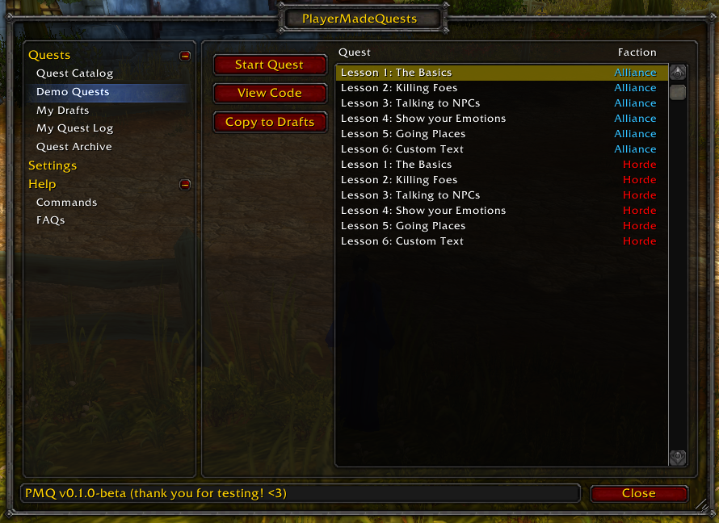
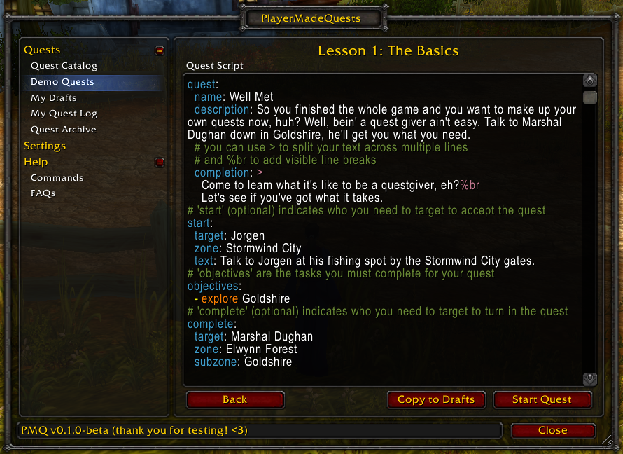

# PlayerMadeQuests

> PlayerMadeQuests is **no longer being maintained**. You can download the final release from the links below. The contents of the wiki have been copied to this site for your reference.
>
> If you have questions, our [Discord](https://discord.gg/gHMjCgs) server is still open - feel free to stop by! If you're interested in continuing to develop PMQ, you can:
> * Submit a [pull request](https://github.com/runeberry/PlayerMadeQuests/pulls), and reach out to Dolphinspired on Discord for review, or
> * Fork the [repository](https://github.com/runeberry/PlayerMadeQuests) on GitHub, and publish your own version(s) of the addon
>
> To everyone out there who enjoyed the addon, thank you for your support!

**PlayerMadeQuests (PMQ)** is an addon for [World of Warcraft: Classic](https://worldofwarcraft.com/en-us/wowclassic) that allows you to write your own custom quests, play them in-game, and share them with other players.

Ready to try it out? You can get it here:

* Download PMQ from [CurseForge](https://www.curseforge.com/wow/addons/pmq) (can be installed through the [WowUp](https://wowup.io/) addon manager)
* Download the latest release in a zip file directly from [Github](https://github.com/runeberry/PlayerMadeQuests/releases)

Several playable demo quests are provided with PMQ to help you learn how to write your own quests. Additional help and even more examples can be found on this Wiki.

## Getting Started

* [How to Write Quests](guides/writing-quests.md)
* [YAML Crash Course](guides/yaml-crash-course.md) - Quickly learn the language used to write PMQ quests
* [Quest Objectives](guides/objectives.md)
* [Start & Complete Objectives](guides/start-complete.md)
* [Quest Requirements](guides/requirements.md)
* [Quest Rewards](guides/rewards.md)

## Advanced Guides

* [Save Data & Cache](guides/save-data.md)
* [Configuration Reference](guides/configuration.md)

## List of Quest Objectives

* [cast-spell](objectives/cast-spell.md)
* [equip-item](objectives/equip-item.md)
* [explore](objectives/explore.md)
* [gain-aura](objectives/gain-aura.md)
* [kill](objectives/kill.md)
* [loot-item](objectives/loot-item.md)
* [say](objectives/say.md)
* [talk-to](objectives/talk-to.md)
* [use-emote](objectives/use-emote.md)

## List of Quest Objective Parameters

* [aura](parameters/aura.md)
* [channel](parameters/channel.md)
* [class](parameters/class.md)
* [coords](parameters/coords.md)
* [emote](parameters/emote.md)
* [equip](parameters/equip.md)
* [faction](parameters/faction.md)
* [goal](parameters/goal.md)
* [guild](parameters/guild.md)
* [item](parameters/item.md)
* [item (for rewards)](parameters/item-rewards.md)
* [language](parameters/language.md)
* [level](parameters/level.md)
* [message](parameters/message.md)
* [recipient](parameters/recipient.md)
* [spell](parameters/spell.md)
* [target](parameters/target.md)
* [text](parameters/text.md)
* [zone](parameters/zone.md)

## Screenshots

<table>
  <tr>
    <td>
       
      <i>Several demo quests are included to help you learn how to write quests for PMQ.</i>
    </td>
    <td>
       
      <i>You can play these demo quests directly, or you can save a copy to your Drafts and make some changes, then try it out!</i>
    </td>
  </tr>
  <tr>
    <td>
       
      <i>Write your own quests in game with just a few lines of script. You can even share your quests with other PMQ users in your party with just the click of a button!</i>
    </td>
    <td>
       
      <i>Quest objectives are tracked and updated in real-time as you complete them.</i>
    </td>
  </tr>
</table>