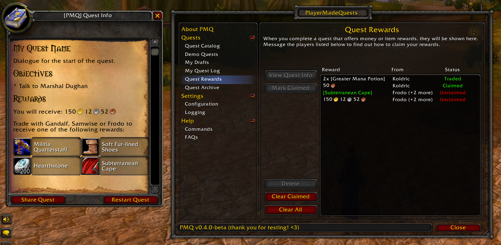
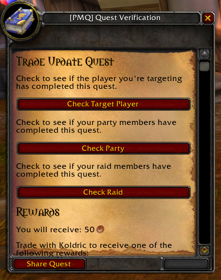

# Rewards

<table>
  <tr>
    <td>
      <a href="assets/images/rewards-menu.png"></a><br/>
      <i>The Quest Rewards menu, and rewards as shown upon completion of a quest.</i>
    </td>
    <td>
      <a href="assets/images/quest-verification-menu.png"></a><br/>
      <i>The Quest Verification menu, which can be accessed for any quest in your Quest Log.</i>
    </td>
  </tr>
</table>

As an option to make your quests more enticing to players, you can specify **rewards** that will be given to players on quest completion. These rewards can take the form of money or items.

The rewards are not generated by PMQ - of course, addons can't simply generate items out of thin air! However, the player will be notified that they can contact a certain player (or group of players) and trade them in order to receive their quest rewards. In addition, PMQ will track which rewards a player is eligible for, and reward-givers will be able to verify that players have actually completed a quest, along with which rewards players are eligible for.

### How it works

#### Claiming Rewards

When you complete a quest that offers rewards, you will see the rewards listed below the completion text for a quest. If the quest asks you to choose a reward, you will need to click one of the items before you're able to complete the quest.

After completing the quest, you can visit the **Quest Rewards** menu (part of the PMQ main menu) anytime to see which rewards you're eligible for, and which players you can claim them from. The players providing the rewards *may not have been notified* that you completed the quest, so you may need to message them and ask about receiving your rewards. This menu exists to help you keep track of which rewards you've earned and will not have any impact on your ability to perform other quests, so you can delete items from the list at any time.

If a reward-giver trades you an item or an amount of money that you're eligible for, then that reward will automatically be marked as "Traded" from that player. However, you can manually mark any reward as "Claimed" by selecting it in the list and clicking **Mark Claimed**. You may want to do this if you got the reward in a trade from a different player than who was listed, or if you received your reward in the mail (mail support may be added in a future update).

#### Distributing Rewards

As a reward-giver, you can verify that a player has completed that quest, as well as see which item rewards they're eligible for. Open the **Quest Log** menu and select the quest you want to verify completion for, then click the **Verify Others** option.

From the Quest Verification menu, you'll be able to verify that either the targeted player, the players in your party, or the players in your raid group have completed a quest. Note that *anyone* can perform verification for any quest, whether or not they shared the quest, and whether or not the quest has rewards.

However, if a quest has rewards and you're a reward-giver for that quest, then the items and money that each player is eligible for will be linked in your chat window. This allows you to quickly scan a group of players for rewards without needing to message each player individually.

### Syntax

```yaml
rewards:
  player: Playername # Required
  money: 2g 46s 13c
  choose: true
  item:
    - 5 Major Mana Potion
    - 20 Major Healing Potion
    - 10 Greater Nature Protection Potion
```

* You must specify either **money** or at least one **item** in your rewards.
* If you specify **choose: true**, then you must specify at least 2 **item** rewards.

### Supported parameters

| Parameter | How it's used |
|---|---|
| **player** | The player(s) who are responsible for giving out the rewards.<br/>You may also use the variables **%author** and **%giver** instead of a player's name. |
| **money** | The amount of money awarded for completing the quest.<br/>This can be written as an amount of copper (such as: 24153) or a string with g/s/c (such as: 2g 41s 53c) |
| **choose** | Set to **true** if the player should choose only *one item* from the list.<br/>Otherwise, it's implied that the player will receive *all* of the listed rewards. |
| [item](parameters/item-rewards.md) | The item(s) awarded for completing the quest. |


### Examples

#### Multiple reward givers

You can specify multiple players who are responsible for giving out the rewards on a quest. If a player trades with any of players listed on the quest, then that trade can count towards the player claiming the quest's reward.

```yaml
rewards:
  player: [ Playerone, Playertwo, Playerthree ]
  money: 5g
```

#### Quest giver as the reward giver

If you specify **%giver** as the player under rewards, then the person who shares the quest will always be responsible for distributing the reward. This way, you can write a quest that provides rewards but doesn't necessarily have to relate back to a specific player or group of players.

```yaml
rewards:
  player: %giver
  money: 5g
```

If you would like, you can also specify **%author** as the reward giver, and the person who originally drafted the quest will always be responsible for distributing rewards.

```yaml
rewards:
  player: %author
  money: 5g
```

#### Single/Multiple item rewards

See [Item (Rewards)](parameters/item-rewards.md) for examples of how to define reward items.

### Usage Notes

* In order to specify a valid game item by name, you must have encountered it in-game at some point during your current play session. For more information about this behavior and how you can work around it, see [Item (Rewards)](parameters/item-rewards.md).
